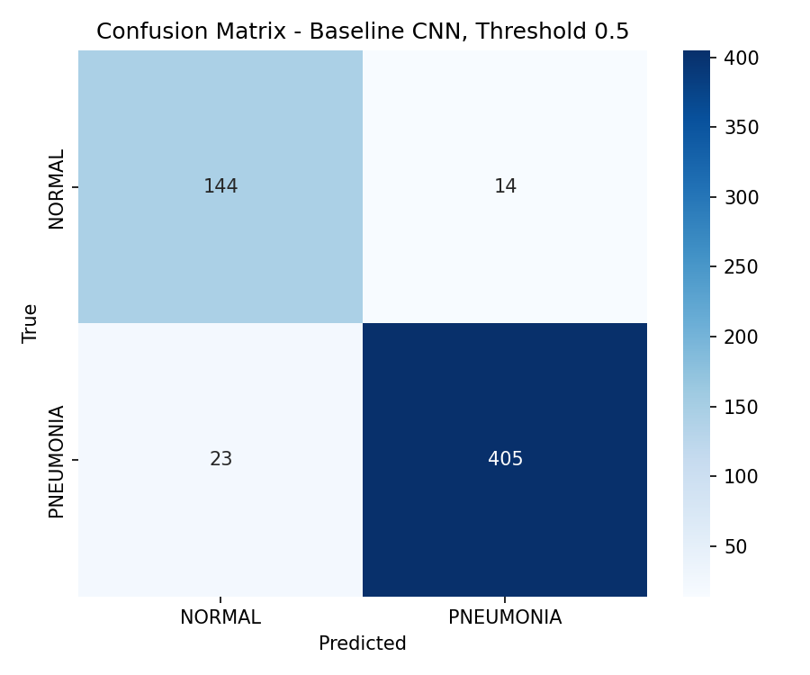

# Checkpoint 2 Report: Pneumonia Detection from Chest X-Rays

Lilie Lin, Junu Rahman, Arooj Shahzadi

## Project Goal

The goal is to build a binary image classifier that distinguishes **NORMAL** and **PNEUMONIA** chest X-ray images.

Dataset: Kaggle - Chest X-Ray Images (Pneumonia) by Paul Mooney.

## Repository and Notebook

GitHub repository:
https://github.com/loonaarc/Adv_AI_Project_Pneumonia/tree/main

Notebook:
https://github.com/loonaarc/Adv_AI_Project_Pneumonia/blob/main/pneumonia_detection_checkpoint2.ipynb

Open notebook in Google Colab:
https://colab.research.google.com/github/loonaarc/Adv_AI_Project_Pneumonia/blob/main/pneumonia_detection_checkpoint2.ipynb

The notebook is designed to run both locally in VS Code and in Google Colab. It downloads the dataset through the Kaggle API, so a Kaggle API token is required. In Colab, the recommended setup is to add `KAGGLE_API_TOKEN` in the Colab Secrets panel.

## Data Understanding

The original Kaggle dataset contains separate `train`, `val`, and `test` folders. The provided validation split is very small:

| Original split | NORMAL | PNEUMONIA | Total |
| --- | ---: | ---: | ---: |
| train | 1341 | 3875 | 5216 |
| val | 8 | 8 | 16 |
| test | 234 | 390 | 624 |

Because 16 validation images are not enough for reliable model selection, the notebook creates a new reproducible stratified 80/10/10 split across all downloaded images.

| Working split | NORMAL | PNEUMONIA | Total |
| --- | ---: | ---: | ---: |
| train | 1266 | 3418 | 4684 |
| val | 159 | 427 | 586 |
| test | 158 | 428 | 586 |

The split is saved to `outputs/results/dataset_split_80_10_10.csv`.

The dataset is imbalanced toward pneumonia images. In the working split, the
training set contains 1,266 NORMAL images and 3,418 PNEUMONIA images. This
imbalance is important because a model can achieve high accuracy while still
performing worse on the minority class.

Patient-level leakage is an important limitation. This Kaggle release does not
provide a separate patient metadata table, and the filenames are not documented
as reliable patient identifiers. Therefore, the split used here is an
image-level stratified split. If patient IDs were available, all images from the
same patient should be assigned to only one split using a grouped split.

Class distribution for the working split:

Example training images:

Manual visual inspection of the sample grid shows that the images are generally
recognizable chest X-rays, but they vary in brightness, contrast, size, and
positioning. Some cases are visually harder than others. From a non-expert
perspective, the difference between NORMAL and PNEUMONIA is not always obvious:
pneumonia cases may show cloudier or more opaque lung regions, but the pattern
is often subtle. The checkpoint feedback notebook also includes a small image-quality sample
check for contrast and a sharpness proxy, and saves a visual review grid of the sampled
images with the lowest contrast and lowest sharpness proxy.

Image-quality review examples:

## Data Preprocessing

Images are loaded from the split manifest and processed as follows:

- decode image files as grayscale
- resize to `224 x 224`
- convert grayscale images to 3 channels for CNN compatibility
- normalize pixel values to `[0, 1]`
- apply online data augmentation only to the training split

Training augmentation includes small rotations, zoom, horizontal flip, and
contrast variation. Augmentation is online, so no extra image files are written
to disk. Each epoch still iterates over 4,684 training images, but the model may
see randomly transformed versions across epochs. Because augmentation is applied
uniformly to training batches, the original class distribution is preserved; it
does not oversample NORMAL images.

To address the class imbalance during baseline training, the notebook now uses
class weights. This keeps the same number of images per epoch while increasing
the loss contribution of the minority NORMAL class.

Horizontal flipping is used cautiously. For this binary task, the label only
indicates whether pneumonia is present, not whether it is left-sided or
right-sided. A flip should therefore not change the target label. However,
flipping would be less appropriate for medical tasks where laterality or
anatomical orientation is part of the prediction target.

## Baseline Model

The baseline is a small convolutional neural network:

- 3 convolution + max pooling blocks
- dropout for regularization
- dense hidden layer
- sigmoid output for binary classification

The model uses Adam, binary cross-entropy loss, class weights for the imbalanced
training data, and reports accuracy, precision, and recall.

The checkpoint feedback notebook now exports a baseline architecture table to
`outputs/results/baseline_architecture.csv`, including each layer, output shape,
and parameter count.

## Baseline Results

The baseline CNN is trained with early stopping monitoring validation loss. The
validation curves should be interpreted carefully: even after replacing the tiny
original validation split, this is still a single split of an imbalanced medical
image dataset. Class weighting improves the imbalance handling, but it can also
change the validation dynamics.

This instability is a key checkpoint finding. It may be caused by the class imbalance, the single random split, the small CNN architecture, or difficult individual X-ray images. Therefore, the test metrics below are treated as baseline evidence, not as final proof that the model is reliable.

The checkpoint feedback notebook computes ROC-AUC, Precision-Recall AUC, and a
validation-based threshold analysis table. The default threshold of 0.5 is kept
as a baseline reference, but this is only a starting point. In a medical
screening setting, false negatives are especially costly, so the notebook now
selects a threshold on the validation split using sensitivity, specificity, and
false-negative trade-offs, then applies that selected threshold once to the test
split.

Baseline training curves:

The unstable validation curve in this baseline run shows a limitation of relying
on one validation split. Simpler ways to reduce this issue would be to repeat
training with different random seeds or use stratified k-fold cross-validation
if compute allows.

The latest exact metrics are generated by the notebook and saved in:

- `outputs/results/baseline_metrics.txt`
- `outputs/results/classification_report_default_threshold.txt`
- `outputs/results/classification_report_selected_threshold.txt`
- `outputs/results/validation_threshold_analysis.csv`

Confusion matrix figure:

Generated result files:

- `outputs/results/baseline_metrics.txt`
- `outputs/results/classification_report_default_threshold.txt`
- `outputs/results/classification_report_selected_threshold.txt`
- `outputs/figures/training_curves.png`
- `outputs/figures/confusion_matrix.png`
- `outputs/figures/confusion_matrix_selected_threshold.png`
- `outputs/figures/roc_curve.png`
- `outputs/figures/precision_recall_curve.png`
- `outputs/results/threshold_analysis.csv`
- `outputs/results/validation_threshold_analysis.csv`
Transfer-learning model comparison and validation-based final model selection
are continued in the separate draft notebook
`project_submission.ipynb`. This keeps checkpoint 2 focused
on the implemented feedback for data understanding, preprocessing, baseline
architecture, and baseline evaluation.

## Initial Observations

- The dataset is strongly imbalanced toward pneumonia cases.
- The original validation split is too small, so an 80/10/10 stratified split is used for a more stable validation signal.
- The baseline CNN now implements class weighting to address imbalance during training.
- The default threshold of 0.5 is compared with a validation-selected threshold for the medical screening trade-off.
- The unstable validation curve shows that the single validation split should be interpreted cautiously; repeated runs could make the estimate more reliable.
- The separate project-submission notebook continues with validation-based model comparison and validation-based threshold selection before final selected-model test evaluation.
- The baseline CNN provides a first performance reference, but it should not be treated as a final reliable medical model.
- Reproducibility files are included as `requirements.txt` and `python_version.txt`.

