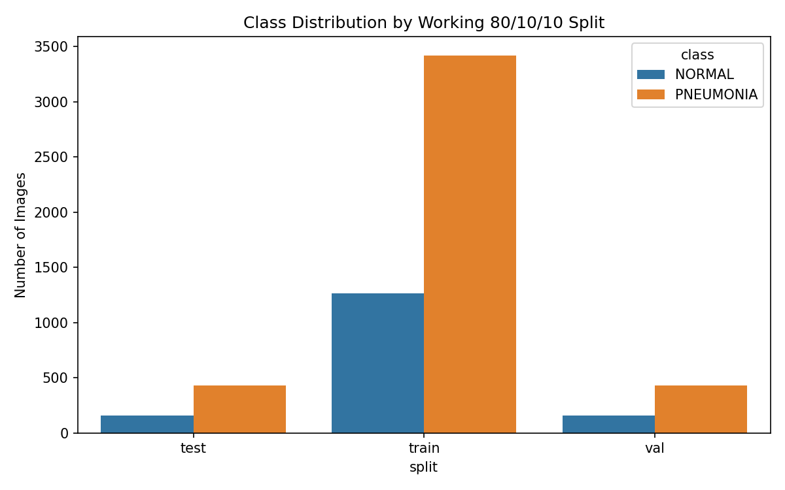
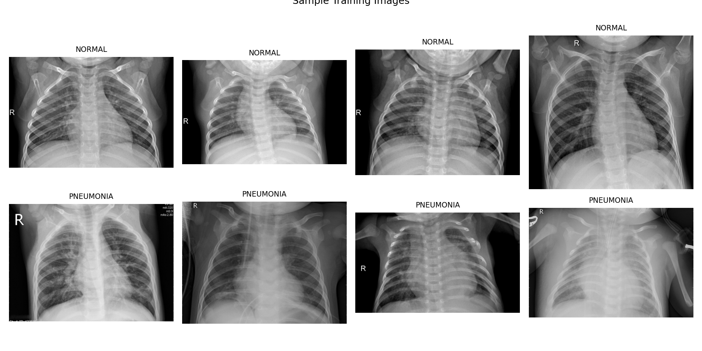
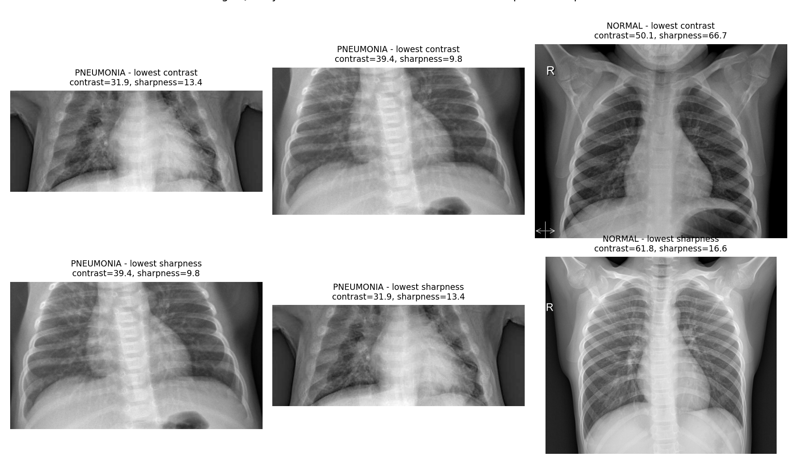
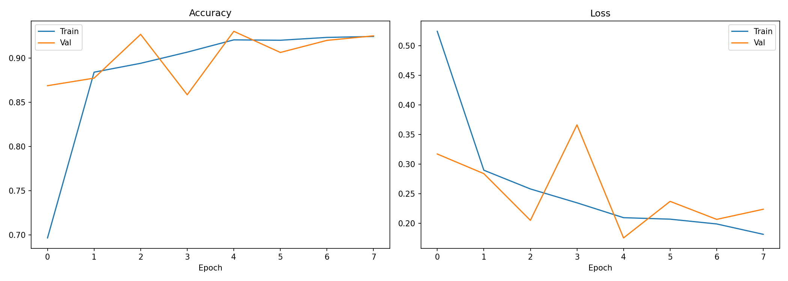
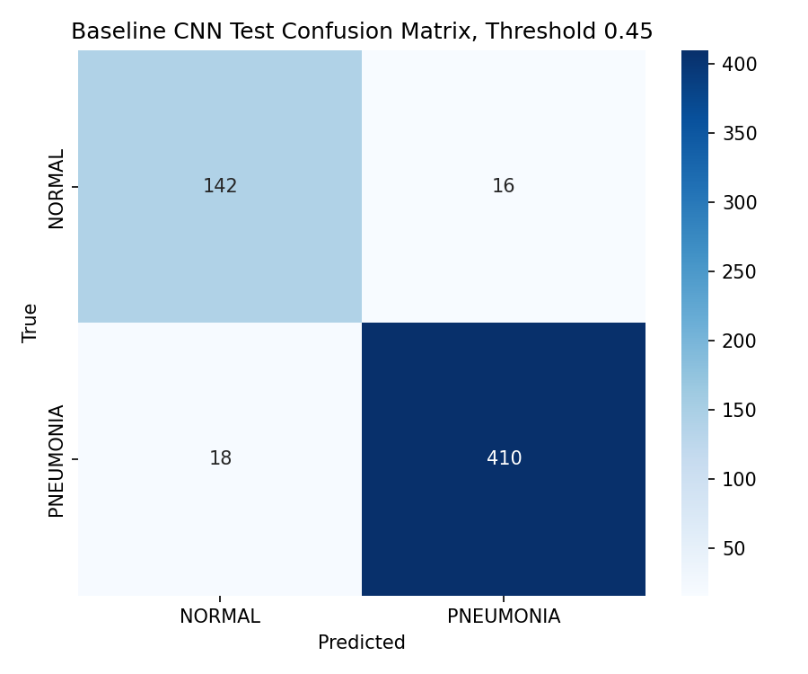
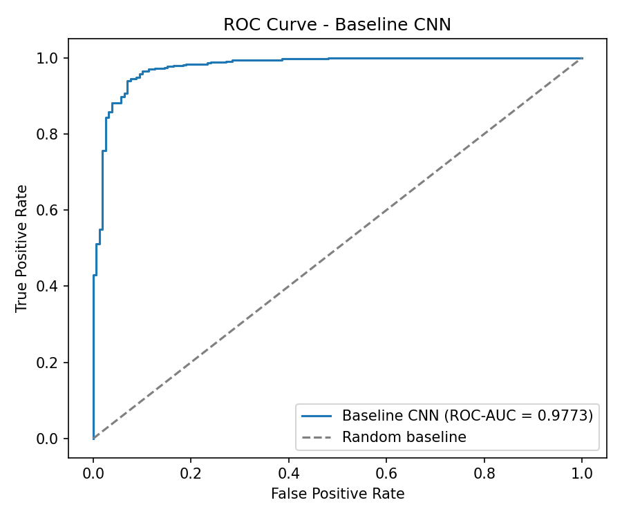
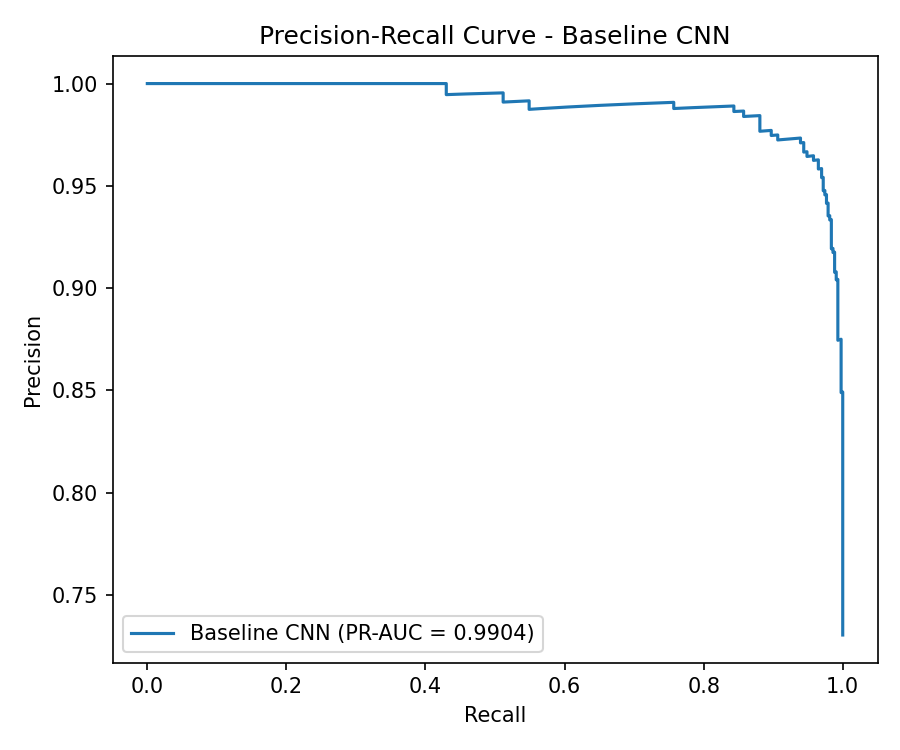
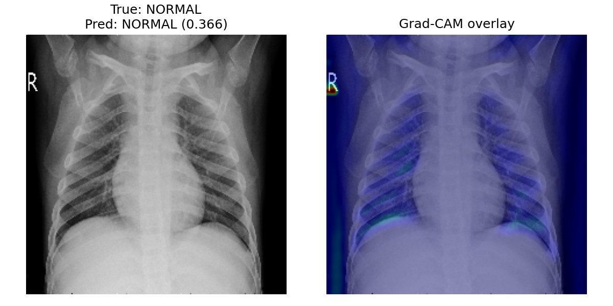
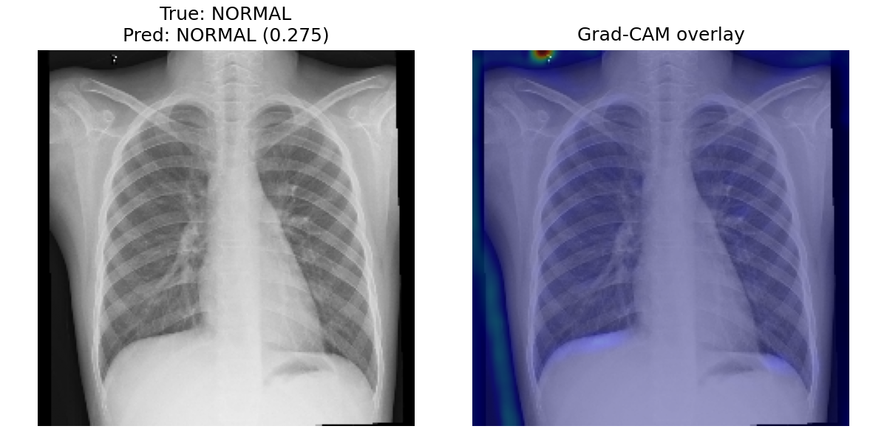
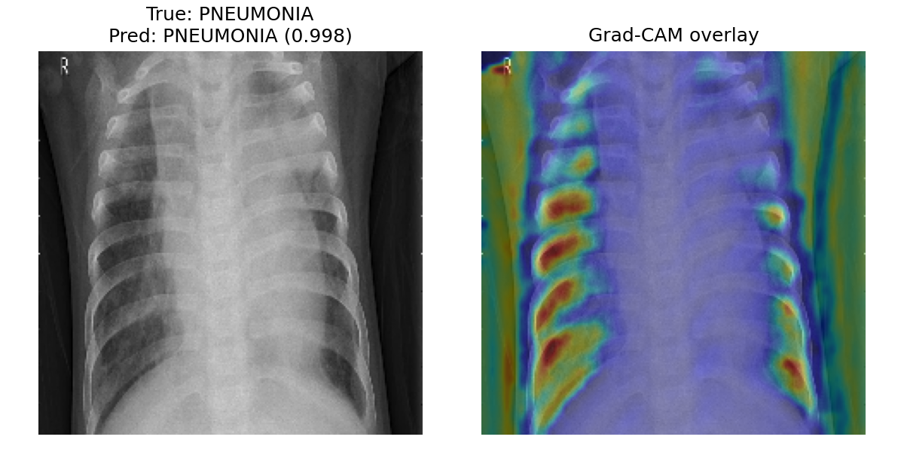

# Final Project Report: Pneumonia Detection from Chest X-Rays

Lilie Lin, Junu Rahman, Arooj Shahzadi

## 1. Motivation and Problem Understanding

The project builds a binary image classifier for chest X-ray images with the two classes **NORMAL** and **PNEUMONIA**. Pneumonia screening is clinically relevant because missed pneumonia cases can delay treatment. In this project, the model is treated as an experimental machine-learning system. The results would require clinical validation before any real medical use.

Dataset: Kaggle Chest X-Ray Images (Pneumonia) by Paul Mooney.

Repository:
https://github.com/loonaarc/Adv_AI_Project_Pneumonia/tree/modelcomparison

Final notebook in the repository:
https://github.com/loonaarc/Adv_AI_Project_Pneumonia/blob/modelcomparison/final_project.ipynb

Open final notebook in Google Colab:
https://colab.research.google.com/github/loonaarc/Adv_AI_Project_Pneumonia/blob/modelcomparison/final_project.ipynb

## 2. Related Work and Method Choice

Convolutional neural networks are a natural starting point for this task because they learn local image patterns directly from pixels. For medical image datasets, transfer learning is also relevant because pretrained CNNs can reuse general visual features and often need less task-specific data than training a larger model from scratch.

Related work and benchmark context:

- Wang et al. introduced ChestX-ray14, a large public chest X-ray dataset with 112,120 frontal X-ray images and 14 thoracic disease labels: https://arxiv.org/abs/1705.02315
- Rajpurkar et al. proposed CheXNet, a DenseNet-121 model for pneumonia detection on chest X-rays: https://arxiv.org/abs/1711.05225
- Kermany et al. published the pediatric chest X-ray pneumonia dataset on which the Kaggle dataset is based: https://www.cell.com/cell/fulltext/S0092-8674(18)30154-5

Based on this context, the project compares one custom CNN baseline with two ImageNet transfer-learning models:

- a custom CNN trained from scratch
- MobileNetV2 as a lightweight pretrained architecture
- DenseNet121 as a larger architecture related to published chest X-ray work

The comparison is based on the same data split, same preprocessing pipeline, same class weights, and validation-set metrics. The test set is used only after the model and threshold have been selected.

## 3. Dataset Understanding

The original Kaggle dataset is already separated into `train`, `val`, and `test` folders, but the original validation split is too small for reliable model selection.

| Original split | NORMAL | PNEUMONIA | Total |
| --- | ---: | ---: | ---: |
| train | 1341 | 3875 | 5216 |
| val | 8 | 8 | 16 |
| test | 234 | 390 | 624 |

Because the original validation split contains only 16 images, the notebook creates a reproducible stratified 80/10/10 split across all downloaded images.

| Working split | NORMAL | PNEUMONIA | Total |
| --- | ---: | ---: | ---: |
| train | 1266 | 3418 | 4684 |
| val | 159 | 427 | 586 |
| test | 158 | 428 | 586 |

The split is saved to `outputs/results/dataset_split_80_10_10.csv`.

The dataset is imbalanced toward pneumonia images. In the working training split, 1,266 images are NORMAL and 3,418 are PNEUMONIA. This matters because accuracy alone can hide weaker performance on the minority class. For this reason, the evaluation includes recall, PR-AUC, false negatives, and confusion matrices.

Patient-level leakage is an important limitation. The Kaggle release does not provide a separate patient metadata table, and the filenames are not documented as reliable patient identifiers. The split is therefore an image-level stratified split. If patient IDs were available, all images from the same patient should be assigned to only one split using a grouped split.

Class distribution for the working split:

Example training images:

Manual visual inspection shows that the images are recognizable chest X-rays, but they vary in brightness, contrast, size, and positioning. From a non-expert perspective, the difference between NORMAL and PNEUMONIA is not always obvious. Pneumonia cases may show cloudier or more opaque lung regions, but the visual differences can be subtle.

The notebook also performs a small image-quality review using contrast and a sharpness proxy. In the sampled images, no low-contrast flags were found, but several images were marked by the blur/sharpness proxy. These automatic flags are only screening indicators, so the saved examples are inspected visually as well.

| Class | Sampled images | Median width | Median height | Median contrast std | Median sharpness proxy | Low-contrast flags | Possible blur flags |
| --- | ---: | ---: | ---: | ---: | ---: | ---: | ---: |
| NORMAL | 12 | 1579.0 | 1242.5 | 63.61 | 40.53 | 0 | 9 |
| PNEUMONIA | 12 | 1292.0 | 844.0 | 54.28 | 51.40 | 0 | 6 |

Image-quality review examples:

## 4. Preprocessing and Augmentation

Images are loaded from the split manifest and processed as follows:

- decode image files as grayscale
- resize images to `224 x 224`
- convert grayscale images to 3 channels for compatibility with ImageNet transfer-learning models
- normalize pixel values to `[0, 1]`
- apply augmentation only to the training split

Augmentation is online and training-only. No augmented image files are written to disk. Each epoch iterates over the 4,684 original training images, but the model can see randomly transformed versions of them across epochs.

Training augmentation includes small rotations, zoom, horizontal flip, and contrast variation. Because augmentation is applied uniformly to training batches, it preserves the original class distribution. It does not create extra NORMAL images to rebalance the dataset.

Class imbalance is handled through class weights during training. This keeps the same number of training images per epoch while increasing the loss contribution of the minority NORMAL class.

Horizontal flipping is used cautiously. The prediction target is only pneumonia presence or absence, not left/right laterality, so flipping should not change the label. For medical tasks where anatomical side is part of the target, horizontal flipping would be less appropriate.

## 5. Models and Training Setup

Three models are compared:

| Model | Description |
| --- | --- |
| Baseline CNN | Custom CNN trained from scratch with class weights, dropout, and early stopping |
| MobileNetV2 | Frozen ImageNet-pretrained base with task-specific binary classification head |
| DenseNet121 | Frozen ImageNet-pretrained base with task-specific binary classification head |

The baseline CNN architecture is:

| Layer | Output shape | Parameters |
| --- | --- | ---: |
| Conv2D | `(None, 222, 222, 32)` | 896 |
| MaxPooling2D | `(None, 111, 111, 32)` | 0 |
| Conv2D | `(None, 109, 109, 64)` | 18,496 |
| MaxPooling2D | `(None, 54, 54, 64)` | 0 |
| Conv2D | `(None, 52, 52, 128)` | 73,856 |
| MaxPooling2D | `(None, 26, 26, 128)` | 0 |
| Flatten | `(None, 86528)` | 0 |
| Dropout | `(None, 86528)` | 0 |
| Dense | `(None, 128)` | 11,075,712 |
| Dropout | `(None, 128)` | 0 |
| Dense | `(None, 1)` | 129 |

All models use binary cross-entropy loss and Adam optimization. Early stopping is used to reduce overfitting. The transfer-learning models keep their pretrained convolutional base frozen and train only the classification head. MobileNetV2 and DenseNet121 include the correct ImageNet preprocessing inside the model graph.

## 6. Evaluation Strategy

The project uses:

- accuracy
- precision
- recall / sensitivity
- F1-score
- ROC-AUC
- PR-AUC
- false negatives and false positives
- confusion matrices
- training and validation curves

For pneumonia screening, false negatives are especially important because they represent pneumonia images predicted as normal. The default threshold of `0.5` is reported as a baseline reference, but the final threshold is selected on validation data. The selected threshold is then applied once to the held-out test split.

Model selection is also based on validation metrics. The predefined ranking is validation PR-AUC first, then ROC-AUC and recall. PR-AUC is emphasized because the dataset is imbalanced and the positive class is clinically important.

## 7. Baseline Results

The baseline CNN is trained with early stopping and class weights. Its default-threshold test result is:

| Metric | Baseline CNN at threshold 0.5 |
| --- | ---: |
| Loss | 0.1753 |
| Accuracy | 0.9369 |
| Precision | 0.9666 |
| Recall / sensitivity | 0.9463 |
| ROC-AUC | 0.9773 |
| PR-AUC | 0.9904 |
| False negatives | 23 |
| False positives | 14 |

Default-threshold test classification report:

| Class | Precision | Recall | F1-score | Support |
| --- | ---: | ---: | ---: | ---: |
| NORMAL | 0.8623 | 0.9114 | 0.8862 | 158 |
| PNEUMONIA | 0.9666 | 0.9463 | 0.9563 | 428 |
| Macro avg | 0.9144 | 0.9288 | 0.9212 | 586 |
| Weighted avg | 0.9385 | 0.9369 | 0.9374 | 586 |

Baseline training curves:

The validation curve is not perfectly smooth, which is expected for a single split of an imbalanced medical image dataset. Class weighting helps address imbalance, but it can also make the validation dynamics less stable. Repeated runs with different random seeds or stratified k-fold cross-validation would give a more reliable estimate if runtime allowed.

## 8. Model Comparison and Final Selection

Validation comparison:

| Model | Accuracy | Precision | Recall | F1-score | ROC-AUC | PR-AUC | False negatives | False positives |
| --- | ---: | ---: | ---: | ---: | ---: | ---: | ---: | ---: |
| Baseline CNN | 0.9283 | 0.9529 | 0.9485 | 0.9507 | 0.9729 | 0.9893 | 22 | 20 |
| MobileNetV2 | 0.9334 | 0.9389 | 0.9719 | 0.9551 | 0.9734 | 0.9870 | 12 | 27 |
| DenseNet121 | 0.8908 | 0.9618 | 0.8852 | 0.9220 | 0.9625 | 0.9797 | 49 | 15 |

The Baseline CNN achieved the highest validation PR-AUC. MobileNetV2 achieved the highest validation recall and F1-score, with fewer false negatives but more false positives. DenseNet121 performed worst in this run, despite being the largest model. This can happen when a frozen pretrained representation is not well matched to the task or when the classification head needs more tuning.

Following the predefined validation ranking, the Baseline CNN was selected as the final model. This selection is reasonable because of its PR-AUC and balanced validation behavior. At the same time, MobileNetV2 remains an important comparison point because it had the highest validation sensitivity.

## 9. Threshold Selection and Final Test Result

The final threshold is selected on the validation set using the rule: highest specificity while keeping pneumonia recall at least `0.95`. For the selected Baseline CNN, this chooses threshold `0.45`.

Validation threshold trade-off for selected thresholds:

| Threshold | Precision | Recall / sensitivity | Specificity | False negatives | False positives |
| --- | ---: | ---: | ---: | ---: | ---: |
| 0.35 | 0.9290 | 0.9813 | 0.7987 | 8 | 32 |
| 0.40 | 0.9348 | 0.9742 | 0.8176 | 11 | 29 |
| 0.45 | 0.9492 | 0.9625 | 0.8616 | 16 | 22 |
| 0.50 | 0.9529 | 0.9485 | 0.8742 | 22 | 20 |
| 0.55 | 0.9574 | 0.9485 | 0.8868 | 22 | 18 |

This table shows the screening trade-off clearly. Lower thresholds catch more pneumonia cases but create more false positives. Higher thresholds reduce false positives but increase false negatives. The chosen threshold `0.45` keeps validation recall above the target while improving sensitivity compared with the default threshold.

Final selected-model test result:

| Model | Threshold | Accuracy | Precision | Recall | F1-score | ROC-AUC | PR-AUC | False negatives | False positives | Specificity |
| --- | ---: | ---: | ---: | ---: | ---: | ---: | ---: | ---: | ---: | ---: |
| Baseline CNN | 0.45 | 0.9420 | 0.9624 | 0.9579 | 0.9602 | 0.9773 | 0.9904 | 18 | 16 | 0.8987 |

Validation-selected-threshold test classification report:

| Class | Precision | Recall | F1-score | Support |
| --- | ---: | ---: | ---: | ---: |
| NORMAL | 0.8875 | 0.8987 | 0.8931 | 158 |
| PNEUMONIA | 0.9624 | 0.9579 | 0.9602 | 428 |
| Macro avg | 0.9250 | 0.9283 | 0.9266 | 586 |
| Weighted avg | 0.9422 | 0.9420 | 0.9421 | 586 |

Selected-model confusion matrix:

ROC and precision-recall curves:

## 10. Explainability

Grad-CAM is used to visualize image regions that influenced the selected model's predictions. The goal is to check whether the model appears to rely on plausible lung regions rather than irrelevant borders or labels. Grad-CAM does not prove clinical correctness, but it is useful as a supporting interpretability check.

Three Grad-CAM examples were generated for the selected model. The examples include two NORMAL images predicted as NORMAL and one PNEUMONIA image predicted as PNEUMONIA. The probabilities and filenames are saved in `outputs/results/gradcam_summary.csv`.

Generated Grad-CAM figures:

## 11. Limitations and Ethical Considerations

Important limitations:

- The split is image-level, not patient-level, so patient-level leakage cannot be fully ruled out.
- The dataset is imbalanced and may not represent all hospitals, imaging devices, patient ages, or patient populations.
- The model was evaluated on one dataset only; external validation was not performed.
- The transfer-learning models were trained with frozen bases only. Fine-tuning may improve them.
- Grad-CAM heatmaps were not reviewed by medical experts.
- The model outputs are not calibrated for clinical decision-making.

The ethical risk is that a model can appear strong on a public benchmark while failing on a different hospital population or scanner type. A real system would require external validation, patient-level splitting, subgroup analysis, calibration, clinical workflow design, and expert review.

## 12. Reproducibility and Generated Artifacts

The repository includes:

- executable notebooks
- fixed random seed
- reproducible split manifest
- saved metrics, figures, and model artifacts
- `requirements.txt`
- `python_version.txt` with Python `3.13.8`

Important generated files:

- `outputs/results/dataset_split_80_10_10.csv`
- `outputs/results/baseline_architecture.csv`
- `outputs/results/validation_model_comparison.csv`
- `outputs/results/model_selection_summary.csv`
- `outputs/results/selected_model_test_metrics.csv`
- `outputs/results/gradcam_summary.csv`

The notebook also saves trained Keras model files in `outputs/models/`. These model files are treated as regenerated artifacts rather than repository files because the baseline model is too large for normal GitHub storage.

## 13. Conclusion

The final pipeline implements the main requirements for the project: data exploration, preprocessing, online augmentation, class imbalance handling, three model variants, validation-based model comparison, validation-based threshold selection, final test evaluation, and Grad-CAM explainability.

The selected Baseline CNN reached a final test accuracy of `0.9420`, pneumonia recall of `0.9579`, ROC-AUC of `0.9773`, and PR-AUC of `0.9904` at threshold `0.45`. The result is strong for a course project, but it should be interpreted with the limitations above, especially the image-level split and the absence of external clinical validation.
